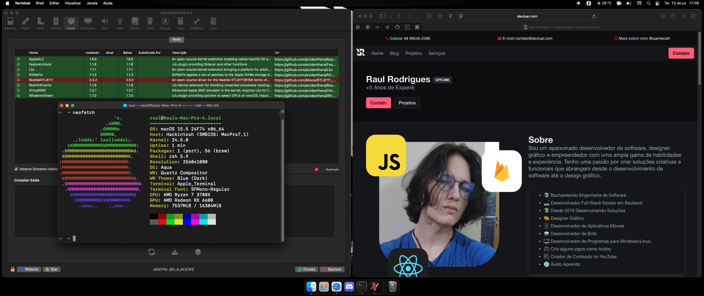

# Hackintosh: MSI B550 Gaming Plus / Ryzen 3 3200G / RX 550 4GB

This repository provides details on my Hackintosh build, running macOS Sequoia 15.2 with OpenCore 1.0.3. Below is a summary of the hardware and its compatibility with macOS.

---

## Hardware Overview

| Component          | Model                          | Status        |
|--------------------|--------------------------------|---------------|
| **Motherboard**    | MSI B550 Gaming Plus          | Fully Working |
| **CPU**            | AMD Ryzen 3 3200G             | Fully Working |
| **GPU**            | AMD RX 550 4GB                | Works Great |
| **RAM**            | 24GB DDR4                     | Fully Working |
| **Storage**        | 250gb NVMe - 250gb sata - 2tb hdd | Fully Working |
| **Audio**          | Realtek ALC Audio (onboard)   | Fully Working |
| **Networking**     | No Network Card Installed     | Not Available |

---

## Compatibility Notes

- **Graphics**: The AMD RX 550 isnot native polaris, i did a fakeid and it works as well.
- **Audio**: Realtek onboard audio is fully functional.
- **Networking**: No AirDrop or Wi-Fi functionality due to the lack of a network card. Im using Ethernet.
- **Emulation**: No supported for AMD, but can use XCode Simulator (tested iphone 16).

---

## Software Setup

- **Bootloader**: OpenCore 1.0.3
- **Operating System**: macOS Sequoia 15.2

---

## Known Issues

- AirDrop and other network-related features are unavailable due to the lack of a compatible network card.
- Emulation (android) is unsupported with this build.

For more details on the configuration files and troubleshooting, please refer to the documentation provided in the repository.

Credits to [Universo Hackintosh](http://universohackintosh.com) for creating helpfull content about hackintosh and how-to.

